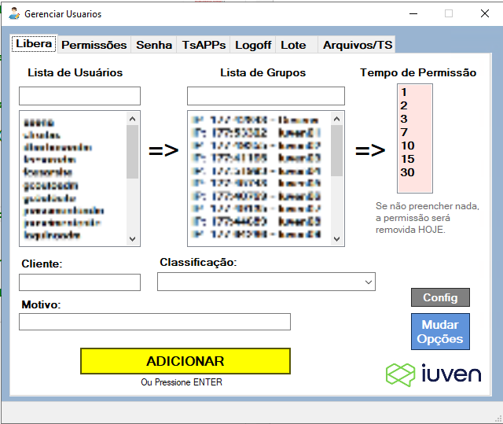
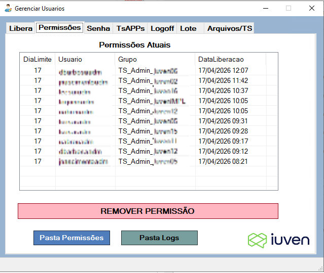
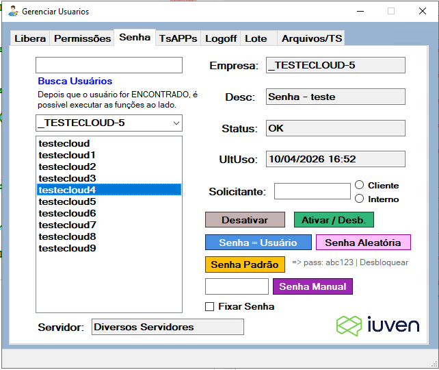
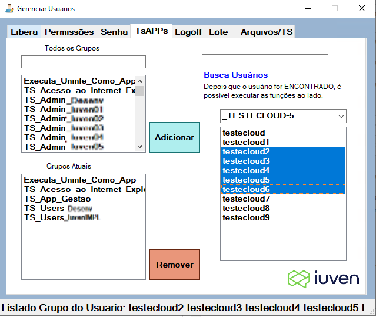
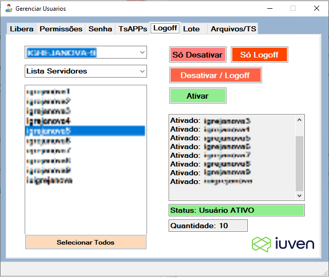
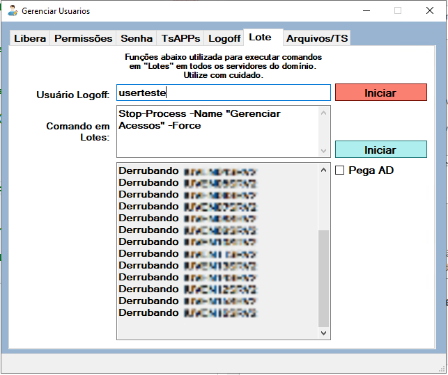
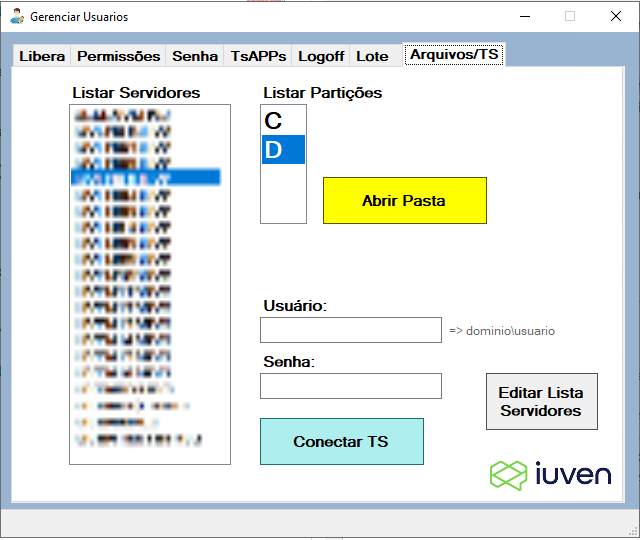

# 🖥️ Gerenciador de Usuários e Permissões AD

Ferramenta desktop desenvolvida em **PowerShell + Windows Forms** para centralizar e automatizar
a gestão de usuários e permissões no **Active Directory**, eliminando processos manuais
dispersos no suporte técnico.

> Desenvolvido com **PowerShell Studio 2022** — IDE profissional para criação de interfaces
> gráficas em PowerShell que permite projetar formulários visualmente e gerar executáveis `.exe`.

---

## 📋 Visão Geral

O sistema unifica em uma única interface gráfica todas as operações mais frequentes do suporte:
liberação temporária de acesso a servidores, reset de senha, desbloqueio de contas, gestão de
grupos e muito mais — com **log de auditoria automático** e **integração com Google Sheets**
para rastreabilidade completa de cada ação.

---

## ✨ Funcionalidades

### 🔐 Permissões Temporárias em Servidores
- Adiciona usuários a grupos de AD com prazo definido: **1, 2, 3, 7, 10, 15 ou 30 dias**
- Controla expiração por arquivo de log nomeado com usuário, grupo e data limite
- Detecta permissão já existente e oferece opção de apenas preencher as planilhas
- Remove permissões diretamente pela lista de acessos ativos

### 🔑 Gestão de Senhas
- **Reset para senha padrão** com obrigatoriedade de troca no próximo logon
- **Reset para senha manual** com opção de fixar a senha definitivamente
- Grava a senha na descrição do usuário quando fixada
- Desbloqueio automático da conta após qualquer reset

### 👤 Gestão de Contas AD
- Consulta de usuários por **OU (empresa/setor)**
- Exibição de **último logon**, **status da conta** (ativo, bloqueado, desativado) e **servidor vinculado**
- Ativar, desativar e desbloquear contas diretamente pela interface
- Busca rápida de usuário por `SamAccountName` em toda a árvore AD

### 👥 Grupos e Aplicações (TS/App)
- Listagem dos grupos de um ou múltiplos usuários simultaneamente
- Adição e remoção de usuários em grupos de aplicações em **lote**
- Busca de grupos por nome com filtro em tempo real

### 🖥️ Sessões RDS / Windows Server
- Lista usuários conectados por servidor ou por OU de clientes
- **Derruba sessões remotas** de usuários ativos via `logoff` remoto por `Invoke-Command`
- Identifica o hostname do servidor a partir do grupo AD do usuário

### 📊 Integração com Google Sheets
- Preenchimento automático de planilhas de controle de solicitações após cada operação
- Registra: solicitante, empresa, servidor, período, motivo, classificação de acesso e responsável
- Execução em background via Python (`gspread` + `oauth2client`) sem travar a interface

### ☁️ Oracle Cloud (OCI)
- Copia automaticamente o perfil `.oci` para o diretório do usuário logado na inicialização
- Garante que todos os operadores tenham as credenciais de acesso à nuvem configuradas

### 📁 Logs de Auditoria
- Registra **todas as operações** com data, hora e usuário executor
- Arquivo centralizado em `C:\script\logs\LOG_Permissoes_Liberadas.txt`
- Pasta de controle de permissões ativas acessível diretamente pelo botão na interface

---

## 🛠️ Tecnologias Utilizadas

| Camada | Tecnologia |
|--------|-----------|
| IDE de Desenvolvimento | **PowerShell Studio 2022** (SAPIEN Technologies) |
| Interface | PowerShell + Windows Forms |
| Diretório | Active Directory (`ActiveDirectory` module) |
| Automação Nuvem | Python · `gspread` · `oauth2client` |
| Infraestrutura | Windows Server · Remote Desktop Services (RDS) |
| Cloud | Oracle Cloud Infrastructure (OCI) |
| Integração | Google Sheets API |

---

## ⚙️ Pré-requisitos

- Windows Server com módulo **Active Directory** disponível
- PowerShell 5.1+
- Python 3.x com `pip` (para integração com Google Sheets)
- Arquivo de credenciais Google (`_GoogleAutenticacao.json`) em `C:\script\LiberaPermissaoPreenchimento\`
- Arquivos de configuração:
  - `ConfigOUs.txt` — caminhos das OUs no AD
  - `Responsaveis.txt` — lista de responsáveis do setor
  - `Sistema.txt` e `Classificacao.txt` — listas para preenchimento dos formulários
  - `servidoresOracleOCID.txt` — mapeamento de servidores OCI

---

## 🚀 Como Executar

1. Clone ou copie os arquivos para `C:\script\LiberaPermissaoPreenchimento\`
2. Abra o arquivo `.psf` no **PowerShell Studio 2022** ou execute o script principal
3. A interface carregará automaticamente os usuários, grupos e OUs do AD
4. Nas configurações, ajuste o arquivo `ConfigOUs.txt` com as OUs do seu ambiente

---

## 📸 Interface

A ferramenta é organizada em **7 abas temáticas**:

---

### Libera — Concessão de acesso temporário a servidores
Selecione o usuário, o servidor (grupo AD) e o prazo. Preencha cliente, motivo e classificação antes de confirmar.

---

### Permissões — Acessos ativos e remoção
Exibe todos os acessos vigentes com usuário, grupo, data de liberação e dia limite. Permite revogar permissões com um clique.

---

### Senha — Gestão de contas de usuário
Busca usuários por OU, mostra status, último logon e empresa. Oferece reset por senha padrão, manual, aleatória ou igual ao username, com opção de fixar a senha.

---

### TsAPPs — Grupos de aplicações
Adiciona ou remove usuários em grupos de acesso a aplicações. Suporta seleção múltipla de usuários e grupos simultâneos.

---

### Logoff — Gerenciamento de sessões RDS
Lista os usuários conectados por servidor. Permite derrubar sessões remotas, desativar e reativar contas em lote.

---

### Lote — Comandos em massa nos servidores
Executa logoff ou comandos PowerShell arbitrários em todos os servidores do domínio simultaneamente.

---

### Arquivos/TS — Acesso remoto a servidores
Lista servidores e partições disponíveis. Permite abrir pastas remotas diretamente e conectar via RDP (mstsc) com credenciais informadas.

---

## 🔓 Código Aberto para Customização

O código deste projeto é **totalmente aberto para modificação**. Sinta-se à vontade para:

- Adaptar as OUs, grupos e nomenclaturas ao seu ambiente AD
- Adicionar ou remover funcionalidades conforme sua necessidade
- Integrar com outros sistemas ou planilhas
- Usar como base para construir sua própria ferramenta de gestão

Basta abrir o arquivo `.psf` no **PowerShell Studio 2022** para visualizar, editar e recompilar
toda a interface e lógica do projeto.

---

## 📝 Licença

Este projeto é de uso livre. Pode ser copiado, modificado e redistribuído sem restrições.
